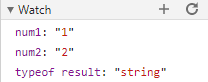
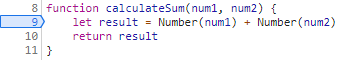

## Part 1

  

The bug was that the inputs for first number and second number were being interpreted as strings and the result printed for sum was a concatenation of the two strings instead of the addition of their numerical values.  

To fix this bug, I used applied the type conversion `Number()` on each of the inputs, so that the result sum would be the operation of adding two numbers.

## Part 2
1. citylots.json
2. part2.js
3. 11.7 MB
4. 4.95 s
5. Mozilla/5.0 (Windows NT 10.0; Win64; x64) AppleWebKit/537.36 (KHTML, like Gecko) Chrome/88.0.4324.104 Safari/537.36
6. Apache
7. Tue, 26 Jan 2021 22:14:13 GMT
8. application/json
9. fetchData()
